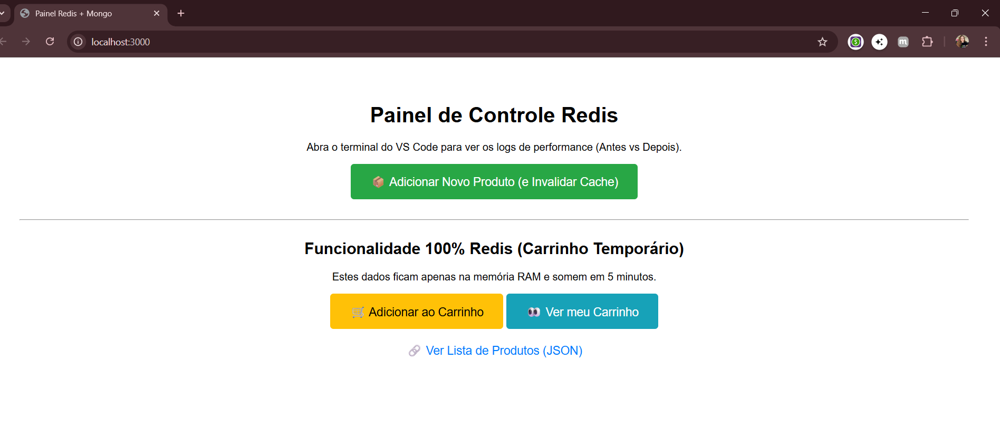

# Learning About REDIS 🚀

Este repositório contém meus estudos práticos e implementações utilizando **Redis** como camada de cache e armazenamento temporário, integrado com **Node.js** e **MongoDB**.

## 📸 Galeria de Evidências

|  |  |

 

  

 

|  |  |

 

### ⚡ Performance: MongoDB vs Redis
*Comparativo de tempo de resposta: MongoDB (220ms) vs Redis (5ms)*

  

---

## 📚 Conceitos Aplicados

### 1. Cache-Aside Pattern (Lazy Loading)
Utilizado na rota de listagem de produtos. A aplicação assume a responsabilidade de verificar o cache antes de consultar o banco de dados.
- **Leitura:** Tenta ler do Redis → Se falhar, lê do Mongo e salva no Redis.
- **Escrita:** Salva no Mongo → Remove a chave correspondente no Redis para forçar atualização.

### 2. TTL (Time To Live)
Configuração de tempo de expiração para dados que não precisam ser eternos, como:
- **Cache de Produtos:** Expira em 60 segundos (evita dados obsoletos por muito tempo).
- **Carrinho de Compras:** Expira em 5 minutos (limpeza automática de carrinhos abandonados).

### 3. Fail-Safe Strategy
O sistema foi desenhado para ser resiliente. Caso o Redis caia, a aplicação continua funcionando consultando diretamente o banco de dados principal (failover silencioso), garantindo disponibilidade.

---

## 🛠️ Tecnologias
- **Redis:** Cache e armazenamento em memória.
- **Node.js & Express:** Backend da aplicação.
- **MongoDB & Mongoose:** Banco de dados persistente.

## 🚀 Como Rodar
1. Certifique-se de ter Redis e MongoDB rodando localmente.
2. Instale as dependências: `npm install`
3. Rode o projeto: `node index.js`
4. Acesse o painel: `http://localhost:3000`

---
*Estudos realizados por [Vanessa](https://github.com/Nessavs)*
